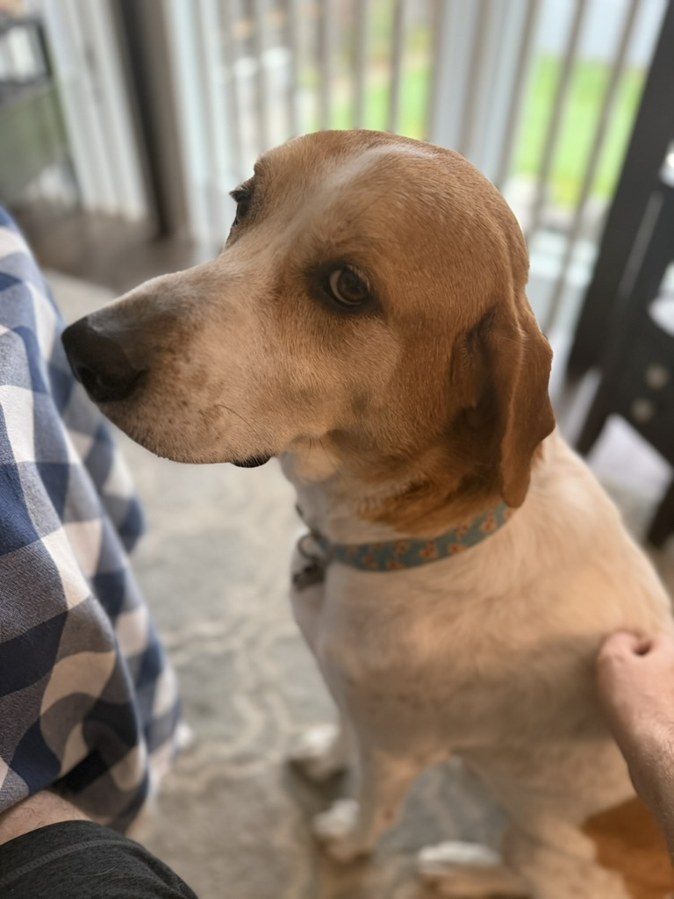

I make software for people that lasts.

I've worked at every point along the abstraction continuum, from low-level language tooling, to LOB apps, to application
design and architecture, all the way to enterprise architecture. I've believe that the low level informs the high level.
But it's equally true that we need to understand the bigger picture to build the lower-levels sensibly.

# How I work

My values are simple, and they're core to my identity.

- **Clarity.** Code must be clear, concise, and understandable. As Einstein once said, "everything should be made as
  simple as possible, but not simpler." Good advice, I think that guy's going places.
- **Correctness.** We trust code to do all kinds of things for us. We want systems to be boring and predictable.
  Surprises are bad when time and money are on the line.
- **Longevity.** Budgets don't allow us to constantly rewrite software. We need to treat our projects as precious
  opportunities to build something that will stand the test of time. It's a gift to the future maintainers -- frequently
  our future selves -- to design with them in mind.
- **Humanity.** Even in the age of AI, writing code is a fundamentally human activity. We do it to meet human needs, and
  it's humans who ultimately bear responsibility for our systems. Code should be humane, and people-centered.

# Range

> A little learning is a dangerous thing. Drink deep, or taste not the Pierian spring. There, shallow draughts
> intoxicates the brain, and drinking largely sobers us again.
>
> <cite>— Alexander Pope, "An Essay on Criticism"</cite>

A little knowledge makes us haughty and overconfident. Pope was describing what Dunning and Kruger would later recognize
as a valley in a curve of knowledge, where one knows more than nothing, but not yet enough to grasp the magnitude of
what they don't yet know. It's only by pushing through, by keeping on, that the headiness and exhilaration of new
knowledge gives way to, as Pope suggests, the sobriety of humility stemming from a new awareness of how much more there
is we don't yet know. That way, the honeymoon leads to a satisfying marriage.

That's why I've always tried to make a serious study of any domain I work in. But, since life is only so long, we have
to make hard choices about where we invest our precious time. For me, those areas have been:

- System architecture and design
- Backend services and APIs, especially in the .NET stack
- Language tools, domain-specific languages, parsers, and compilers.
- Frontend application design and architecture, particularly with React and friends
- Testing and correctness

I love living at different places on the abstraction continuum. Both the forest and the trees fascinate me. And I
believe they provide valuable insights that reinforce each other. And I'm at my happiest whenever I'm learning something
new. Drink deep!

# Why I write

I'm lucky in so many ways. It's a regular occurrence for me to learn something new, to gain some insight from solving a
problem, or to connect some disparate ideas from long ago in my past. The excitement that comes from that is deeply
satisfying. But even better is sharing it.

In my work, I've always gotten special enjoyment out of mentoring more junior developers. There was a time when I
seriously considered an academic career. Writing, as well as speaking and collaborating with others, satisfies a
creative impulse and a desire for community. The writing is for you, but it's also for me. I hope you do get something
out of it. And I also hope you'll reach out when you've got something to say too.

---

# I'm also a person

This site is very tech-focused. But there is a real human behind it. (Hello! 👋)

I'm originally from Iowa, but I've lived in Chicago for the past 15 years. I'll always have be an Iowan at heart, but I
love it here. It's the best combination of big city, Midwestern no-nonsense-ness, good transit, and overall livability
(February temperatures notwithstanding). The longer I stay the harder it is to imagine living anywhere else.

I have a dog. His name is Huckleberry. He's a very good boy, and so handsome. He's such a people dog. On walks, he'll
greet other dogs, but then go to their owners and demand pets and attention from them. It's equal parts adorable and
embarrassing.

I run. I run slowly and poorly, but I enjoy it, and it keeps me healthy and sane. I'm one of those people who got a
Peloton (treadmill in my case) during the pandemic and actually still use it!

I'm a reasonably accomplished home chef. I no longer fear [making the Thanksgiving turkey][turkey-recipe][^martha].

I like doing little DIY projects around the house. I've automated our home to within an inch of its life -- perhaps to
my partner's chagrin.

---

I made this site hoping that you would get something from it. If you want to get in touch, about something you've read
here, to collaborate, network, or even just to chew the fat, [I'd love to hear from you](/contact).

[turkey-recipe]: https://www.marthastewart.com/353184/perfect-roast-turkey

[^martha]:
    Seriously, this recipe is absolutely foolproof. It has never once failed to produce a delicious, flavorful, moist
    turkey. Thanks, Martha!
